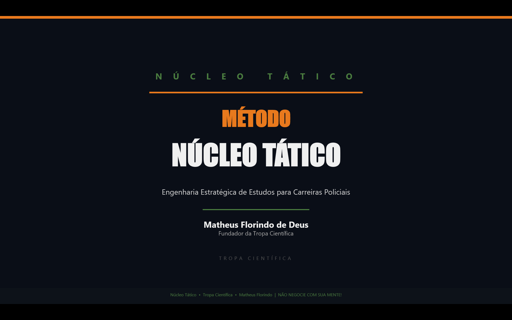

# 🚀 MÉTODO NÚCLEO TÁTICO



## Engenharia Estratégica de Estudos para Carreiras Policiais

**Autor:** Matheus Florindo de Deus  
**Marca:** Núcleo Tático  
Submarca da **Tropa Científica**

---

## 📘 Sobre o Projeto

Este repositório contém o desenvolvimento completo do e-book **Método Núcleo Tático**, criado como projeto prático no desafio da DIO.

O material apresenta uma engenharia estratégica de organização de estudos para carreiras policiais, estruturando o processo de preparação de forma técnica, mensurável e operacional.

O conteúdo aborda:

- Estruturação inteligente de cronograma  
- Periodização estratégica de estudos  
- Método 24h / 7d / 30d  
- Sistema estruturado de resolução de questões  
- Caderno de erros operacional  
- Controle de desempenho por métricas  
- Estratégias para quem estuda trabalhando (incluindo escalas 12x36 e 24x72)  

---

## 🧠 Processo de Construção

O e-book foi construído a partir de um prompt estruturado aplicado no Claude (CoWork), responsável pela geração completa do conteúdo e da capa dentro do PowerPoint.

Após a geração automatizada, o material foi organizado e exportado para versão final em PDF.

---

## 🛠 Tecnologias Utilizadas

- **ChatGPT** → Estruturação estratégica do projeto  
- **Claude / CoWork** → Geração completa do conteúdo e capa no PowerPoint  
- **PowerPoint** → Diagramação e exportação final  
- **GitHub** → Versionamento e documentação  

---

## 📂 Estrutura do Repositório

```
metodo-nucleo-tatico-ebook/
│
├── prompts/
│   └── prompt-geracao-completa-metodo-nucleo-tatico.md
│
├── ebook/
│   ├── metodo-nucleo-tatico.pptx
│   └── metodo-nucleo-tatico.pdf
│
├── assets/
│   └── capa-metodo-nucleo-tatico.png
│
└── README.md
```

---

## 📥 Acessar o Ebook

📘 **Versão final em PDF:**

[Baixar Método Núcleo Tático (PDF)](ebook/metodo-nucleo-tatico.pdf)

🛠 **Versão editável (.pptx):**

[Baixar versão editável](ebook/metodo-nucleo-tatico.pptx)

---

## 🎯 Objetivo do Projeto

Demonstrar aplicação prática de Inteligência Artificial na criação de um produto digital estruturado, com foco em:

- Organização metodológica  
- Clareza estrutural  
- Documentação técnica  
- Versionamento profissional  

---

## 📌 Observação

Projeto desenvolvido como atividade prática no desafio da DIO, com foco em aplicação estratégica de IA na produção editorial.

---

**Núcleo Tático • Tropa Científica**
